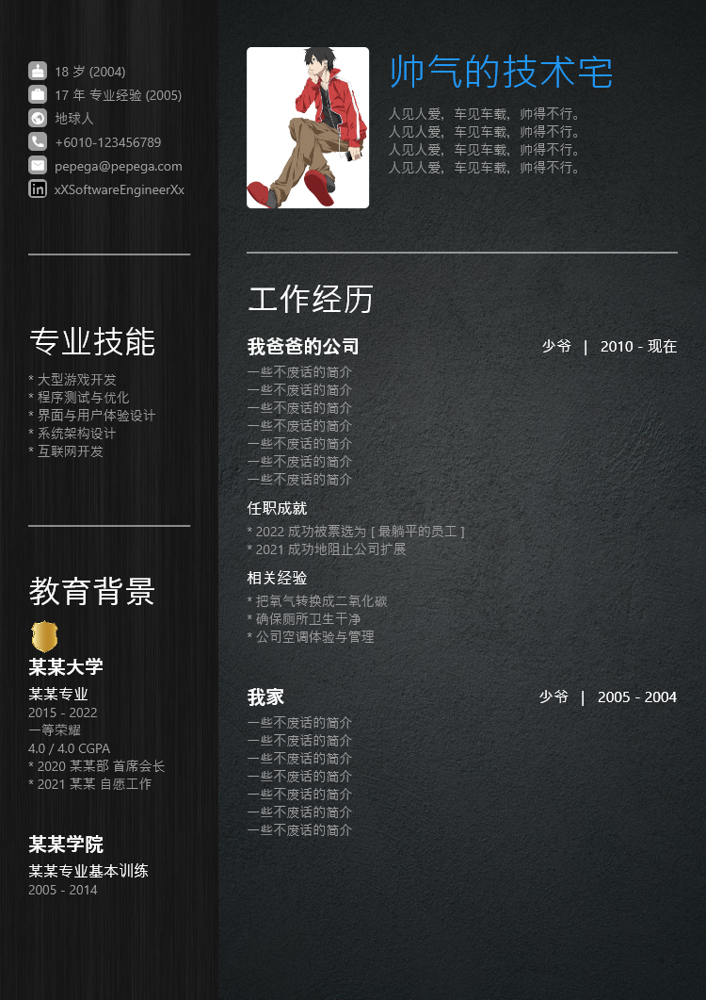

# resume

Generate resume as png/pdf using template (single paged that was found from Tiktok)

Generated Sample:

## How to use:

- On first launch (or expected files are missing), the application will generate 2 files
    - resume.json -> user's resume data, most case only need to modify this file
    - preference.json -> preference, like theme, spacing, sizing, etc
- Modify file then press refresh button or relaunch the application
- Remark: for windows, default location for in/out files are `Documents`

## TODO:

- Better sample preference.json
- English samples
- Watch files
- Adjusting configurables based on feedback
- Docs on schema
